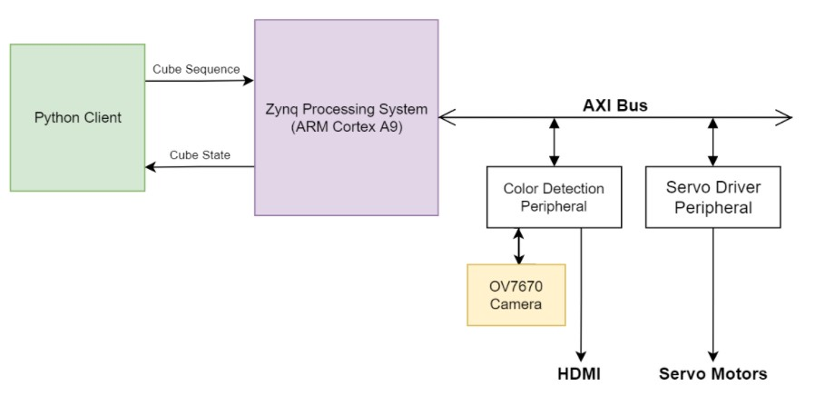
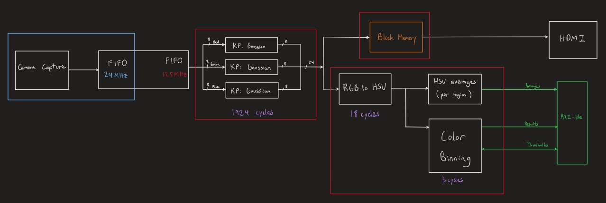
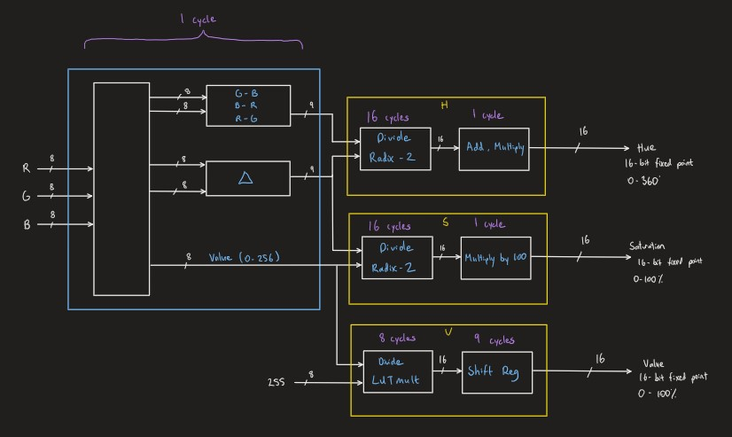
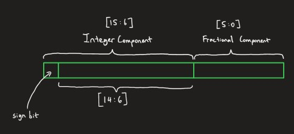

# Puzzle-Cube-Robot

- The objective of this project is to design a Zynq-based robot that solves a Rubik's cube from any configuration.

- A color detection peripheral scans the face of a Rubik's cube using an OV7670 camera. It has an AXI-Lite interface that allows the Zynq PS to configure the color detection thresholds and obtain the results.

- Documentation is pretty messy at this point and is only intended to provide a high level view of how the system will work.

__High-level Overview__

__Color Detection Overview__
- High level system design

__RGB to HSV Algorithm__
- Related modules are denoted with hsv_, hue_, and sat_ prefixes.

- Fixed-point format:
